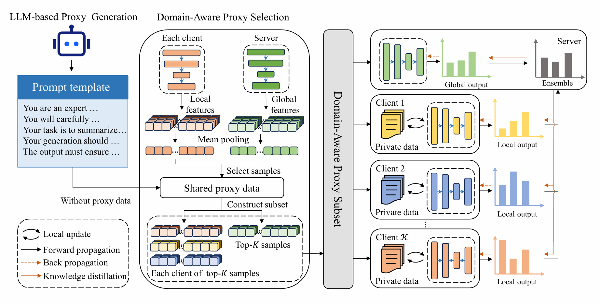

# DPS-FD
This repository contains an implementation with PyTorch for the paper "**Domain-Aware Proxy Selection with LLM for Out-of-Distribution Federated Distillation**". The figure below showes an overview of the proposed federated distillation framework of DPS-FD.
<p align="center">

</p>
For more details about the technical details of DPS-FD, please refer to our paper.

### Installation
Run command below to install the environment (using python3):
```
pip install -r requirements.txt
```

### Usage
1. Download dataset `data`
2. Modify the paths in `dpsfd.sh` to match your local environment.
2. Run the script:
```
bash adafd.sh
```
